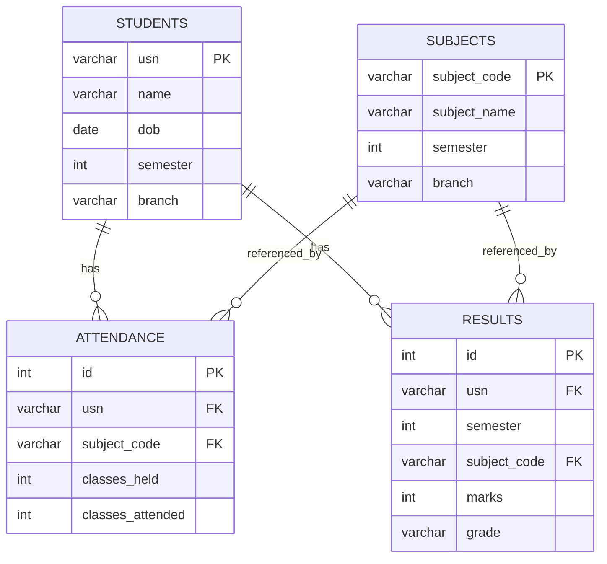
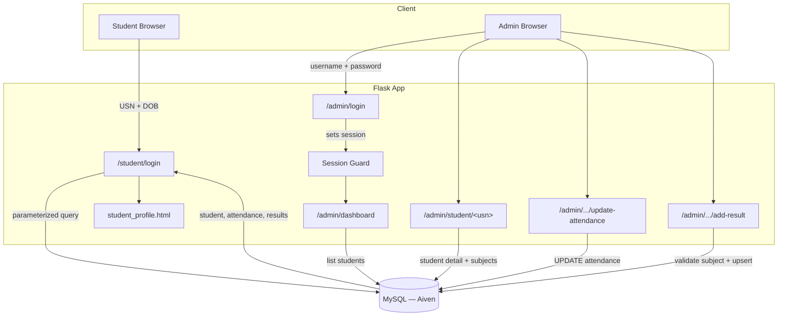

# Architecture

## Tech Stack

| Layer          | Technology                                   |
|----------------|-----------------------------------------------|
| Backend        | Python, Flask                                 |
| Database       | MySQL (hosted on Aiven)                       |
| Templating     | Jinja2                                        |
| Styling        | Custom CSS (no framework)                     |
| App hosting    | Render (via Gunicorn)                         |
| Synthetic data | Faker (`en_IN` locale)                        |

## Project Structure

```
UniBoard/
├── app.py                   # Flask app: all routes (student + admin)
├── db.py                    # Single source of DB connection config (env-var driven)
├── init_aiven_schema.py     # One-time script: creates schema on a fresh Aiven MySQL instance
├── seed_data_mysql.py       # Generates 120 synthetic CSE students + attendance + results
├── schema_mysql.sql         # Table definitions (students, subjects, attendance, results)
├── requirements.txt
├── Procfile                 # Render/Gunicorn start command
├── static/
│   └── style.css            # Design system (tokens, typography, layout)
└── templates/
    ├── student_login.html
    ├── student_profile.html
    ├── admin_login.html
    ├── admin_dashboard.html
    ├── admin_add_student.html
    └── admin_manage_student.html
```

## Database Schema

Four tables, related by foreign keys:

- **students** — `usn` (PK), `name`, `dob`, `semester`, `branch`
- **subjects** — `subject_code` (PK), `subject_name`, `semester`, `branch`
- **attendance** — links a student + subject to `classes_held` / `classes_attended`
- **results** — links a student + subject + semester to `marks` / `grade`

Full definitions are in [`schema_mysql.sql`](./schema_mysql.sql).



## Request Flow



## Design Notes

- **`db.py`** is the single point of MySQL configuration — every route calls `get_db_connection()` rather than opening connections independently, so credentials and SSL settings (via `DB_SSL_CA`) live in exactly one place.
- **Grade calculation** (`marks_to_grade` in `app.py`) is centralized so seeded data and admin-entered results are always graded the same way.
- **Upsert logic** on results: before inserting, the app checks for an existing `(usn, semester, subject_code)` row and updates it instead of creating a duplicate.
- **Subject validation**: attendance and result writes are checked against the `subjects` table first, returning a clean in-app error instead of relying on a raw foreign-key failure.
